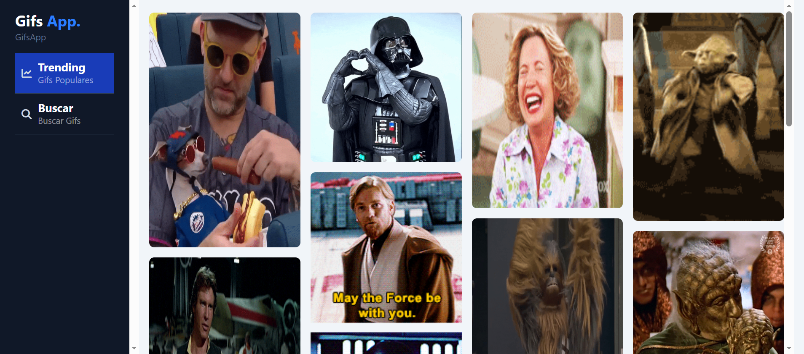
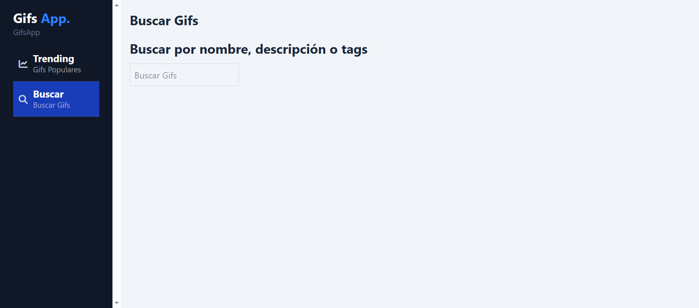
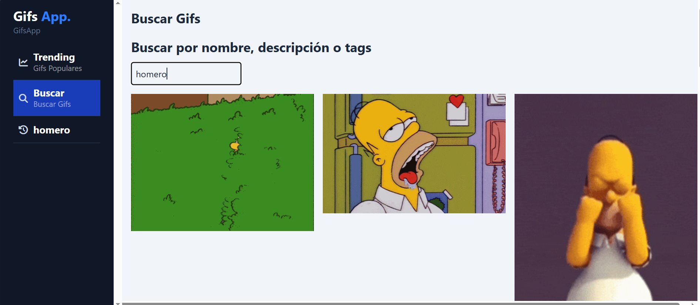
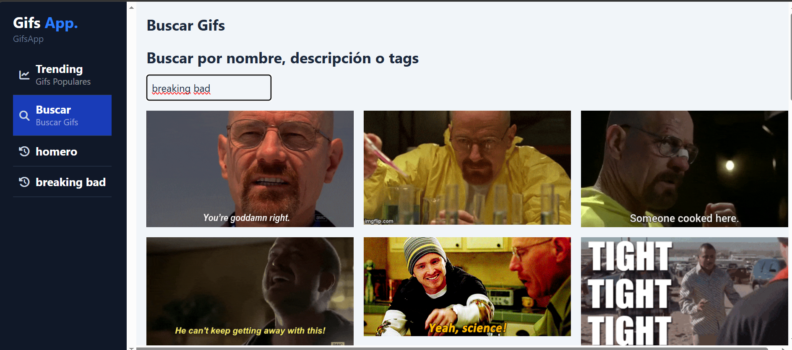

# GifsApp

<p align="center">
  &nbsp;
  
</p>

**GifsApp** aplicacion para obtener Gifs usando la API **GIPHY**. Hecho con **Angular** y para los estilos **Tailwind CSS** y **daisyUI**.

## Run Locally

Clone the project

```bash
  git clone https://github.com/miguel-camara/gifs-app.git
```

Go to the project directory

```bash
  cd gifs-app
```

Install dependencies

```bash
  npm install
```

Generate the `.env` based on the `.env.template`

Run the script

```bash
  npm run set-env
```

Start the server

```bash
  npm run start
```

## Environment Variables

To run this project, you will need to add the following environment variables to your **environment.ts** files

`GIF_KEY` `GIPHY_URL`

## Demo

[Demo](https://gifs-miguel.netlify.app/#/dashboard/trending)

## Screenshots









## Features

- **Gifs App:** En esta aplicación se obtienen gifs usando la API GIPHY.
- **Trending:** En esta sección se obtienen gifs de forma aleatoria conforme se va haciendo scroll se van cargando más gifs esto ocurre por el scroll infinito.
- **Buscar:** En esta sección se pueden buscar gifs por nombre, descripción, etc.
- **Búsquedas:** Cada texto ingresado en el buscador se va mostrando y al dar clic se cargan los elementos previamente buscados estos se mantienen incluso al recargar la página por medio del localstorage.

## Tech Stack

**Frontend:** Angular, Tailwind CSS y daisyUI
